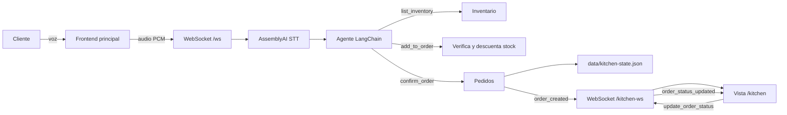

# Agente de pedidos con cocina en tiempo real

## Como correr el proyecto


- Archivo `.env` en la raiz del proyecto con las llaves necesarias:
  - `OPENAI_API_KEY`
  - `ASSEMBLYAI_API_KEY`
  - `CARTESIA_API_KEY` si se usa Cartesia


## instalacion de dependecias 

```bash
cd components/web
pnpm build --watch
```

```bash
cd components/typescript
pnpm run server
```

## Como acceder a /kitchen

Abrir estas rutas:

- agente de voz: `http://localhost:8000`
- Panel de bodega y cocina: `http://localhost:8000/kitchen`

En `/kitchen` se puede ingresar inventario ver pedidos y cambiar su estado.

## Como probar el flujo en tiempo real

1. Abrir `http://localhost:8000/kitchen`.
2. Abrir `http://localhost:8000` en otra ventana.
3. En `/kitchen`, verificar o ingresar ingredientes con stock.
4. En la pantalla principal, iniciar la sesion de voz.
5. Pedir una hamburguesa con ingredientes disponibles.
6. El agente consulta el inventario antes de agregar ingredientes.
7. Al confirmar el pedido, aparece automaticamente en `/kitchen` sin refrescar.
8. Crear varios pedidos para comprobar que se listan correctamente.
9. En `/kitchen`, cambiar un pedido de `nuevo` a `en preparación` y luego a `listo`.

El inventario y los pedidos se guardan localmente en `data/kitchen-state.json`.


## Arquitectura implementada


## Resumen del funcionameinto final 
El funcionamiento del agente de voz es consultar el inventario y agrega productos aquellos productos con disponibilidad de stock. La ruta `/kitchen` está conectada al mismo backend, recibe pedidos en tiempo real y permite administrar inventario y estados.
