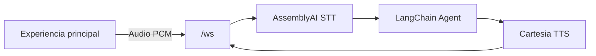
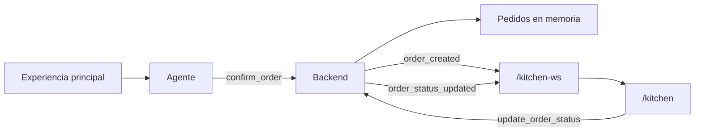

# Como correr el proyecto

## Requisitos

- Node.js 18 o superior
- pnpm
- Python 3.11 y uv si se quiere correr la variante Python
- Llaves en `.env` segun el backend usado:
  - `ASSEMBLYAI_API_KEY`
  - `CARTESIA_API_KEY`
  - `ANTHROPIC_API_KEY` para TypeScript
  - llave del proveedor configurado en Python si se usa `make dev-py`

## Instalacion

```bash
make bootstrap
```

## Ejecutar con backend TypeScript

```bash
make dev-ts
```

La aplicacion queda disponible en:

- Experiencia principal: `http://localhost:8000`
- Pantalla de cocina: `http://localhost:8000/kitchen`

## Ejecutar con backend Python

```bash
make dev-py
```

La ruta de cocina tambien queda disponible en `http://localhost:8000/kitchen`.

## Como probar el flujo en tiempo real

1. Abrir `http://localhost:8000` en una pestana.
2. Abrir `http://localhost:8000/kitchen` en otra pestana o ventana.
3. En la experiencia principal, iniciar la sesion de voz y pedir un sandwich.
4. Confirmar el pedido con el asistente.
5. Cuando el agente ejecuta la herramienta `confirm_order`, el backend registra el pedido en memoria y emite el evento realtime `order_created`.
6. La pantalla `/kitchen` recibe el evento por WebSocket y muestra el pedido sin recargar.
7. Crear mas pedidos desde la experiencia principal para verlos listados en cocina.
8. En `/kitchen`, presionar el boton del pedido para avanzar el estado:
   `nuevo -> en preparación -> listo`.

La pantalla de cocina no es un mockup: esta conectada al flujo real de confirmacion del pedido. Los pedidos se crean en el backend al confirmar la orden y se transmiten por WebSocket a todos los clientes conectados a `/kitchen`.

## Tecnologias usadas

- Svelte 5 y Vite para el frontend.
- Tailwind CSS para estilos.
- Hono y `@hono/node-ws` en el backend TypeScript.
- FastAPI WebSocket en el backend Python.
- LangChain/LangGraph para el agente de pedidos.
- AssemblyAI para speech-to-text.
- Cartesia para text-to-speech.
- WebSocket para actualizacion en tiempo real.

## Arquitectura implementada

El proyecto conserva la arquitectura original de voz:



La extension de cocina se engancha al flujo real de herramientas del agente:



Eventos realtime agregados:

- `orders_snapshot`: se envia al abrir `/kitchen` para cargar pedidos existentes.
- `order_created`: se emite cuando el usuario confirma un pedido desde la experiencia principal.
- `order_status_updated`: se emite cuando cocina cambia el estado de un pedido.

## Archivos principales modificados

- `components/typescript/src/index.ts`: agrega almacenamiento temporal de pedidos, evento realtime para cocina, ruta `/kitchen`, ruta `/api/orders` y WebSocket `/kitchen-ws`.
- `components/typescript/src/types.ts`: agrega tipos de pedidos y eventos de cocina.
- `components/python/src/main.py`: agrega el mismo flujo de pedidos y WebSocket de cocina para la variante Python.
- `components/web/src/App.svelte`: agrega seleccion de vista para servir la experiencia principal o `/kitchen`.
- `components/web/src/lib/kitchen.ts`: cliente WebSocket y store Svelte para pedidos de cocina.
- `components/web/src/lib/components/Kitchen.svelte`: pantalla Kitchen Display System con pedidos, hora, items, estado y boton de avance.
- `components/web/src/lib/types.ts`: agrega tipos compartidos de pedidos y eventos realtime.
- `components/web/vite.config.ts`: agrega proxy de desarrollo para `/kitchen-ws` y `/api`.
- `README.md`: documenta ejecucion, arquitectura, pruebas manuales y guion del video.

## Casos de prueba manuales

### Caso 1: pedido nuevo aparece sin refresh

1. Abrir `http://localhost:8000/kitchen`.
2. Abrir `http://localhost:8000`.
3. Crear y confirmar un pedido con el asistente de voz.
4. Verificar que aparece automaticamente en `/kitchen` sin recargar.

### Caso 2: varios pedidos se listan correctamente

1. Mantener abierta la pantalla `/kitchen`.
2. Confirmar dos o mas pedidos desde la experiencia principal.
3. Verificar que todos aparecen como tarjetas independientes con ID, hora, items y estado.

### Caso 3: cambio de estado

1. En `/kitchen`, presionar el boton de un pedido en estado `nuevo`.
2. Verificar que cambia a `en preparación`.
3. Presionar otra vez.
4. Verificar que cambia a `listo` y el boton queda deshabilitado.

### Caso 4: sincronizacion entre pantallas de cocina

1. Abrir `/kitchen` en dos ventanas.
2. Cambiar el estado de un pedido en una ventana.
3. Verificar que la otra ventana recibe el cambio automaticamente por `order_status_updated`.

## Guion sugerido para el video

Duracion maxima: 3 minutos.

1. Presentacion:
   - Decir nombres.
   - Decir carnets.
   - Decir el link o nombre del repositorio.

2. Ejecucion del proyecto:
   - Mostrar el comando `make bootstrap` si aun no estan instaladas las dependencias.
   - Mostrar `make dev-ts` o `make dev-py`.
   - Abrir `http://localhost:8000`.
   - Abrir `http://localhost:8000/kitchen`.

3. Demostracion del flujo:
   - En la experiencia principal, iniciar la sesion.
   - Crear o confirmar un pedido de sandwich.
   - Mostrar que el pedido aparece automaticamente en `/kitchen` sin recargar la pagina.

4. Varios pedidos:
   - Crear mas de un pedido.
   - Mostrar que la pantalla de cocina lista todos los pedidos correctamente.

5. Cambio de estado:
   - En `/kitchen`, cambiar un pedido de `nuevo` a `en preparación`.
   - Luego cambiarlo a `listo`.
   - Mostrar que la UI refleja el cambio.

6. Explicacion tecnica breve:
   - Explicar que `confirm_order` crea el pedido en el backend.
   - Explicar que el backend emite `order_created` por WebSocket.
   - Explicar que `/kitchen` escucha `/kitchen-ws`.
   - Explicar que los cambios de estado se envian como `update_order_status` y se sincronizan con `order_status_updated`.

7. Cierre:
   - Mencionar que el repositorio incluye este README.
   - Mencionar que el PDF de entrega debe contener el link del video en Google Drive y el link al repositorio publico de GitHub.

Importante para la rubrica: si no hay video, la tarea vale 0. El video debe mostrar claramente que existe `/kitchen`, que los pedidos llegan en tiempo real sin refresh, que la pantalla esta conectada al flujo principal y que se puede cambiar el estado del pedido.
